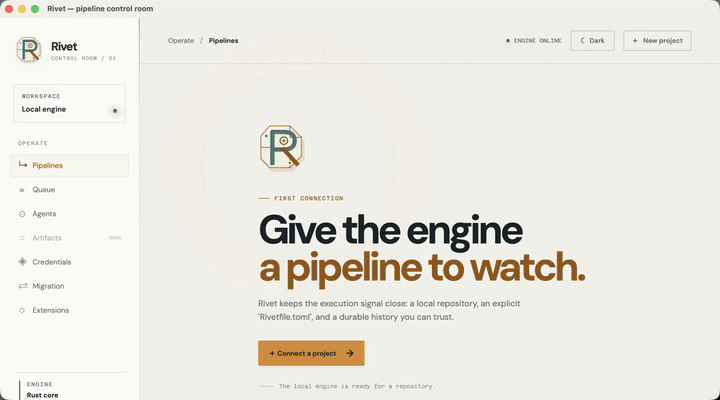
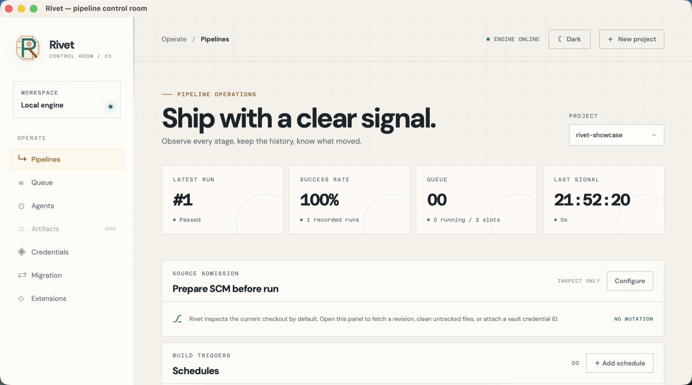
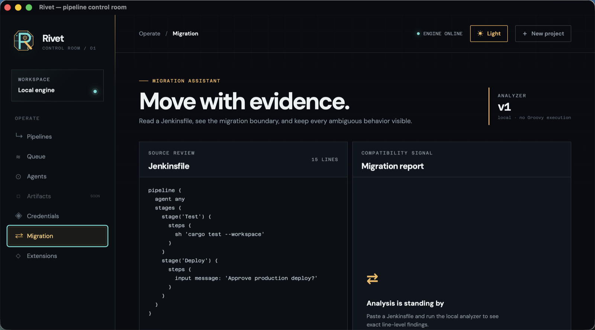
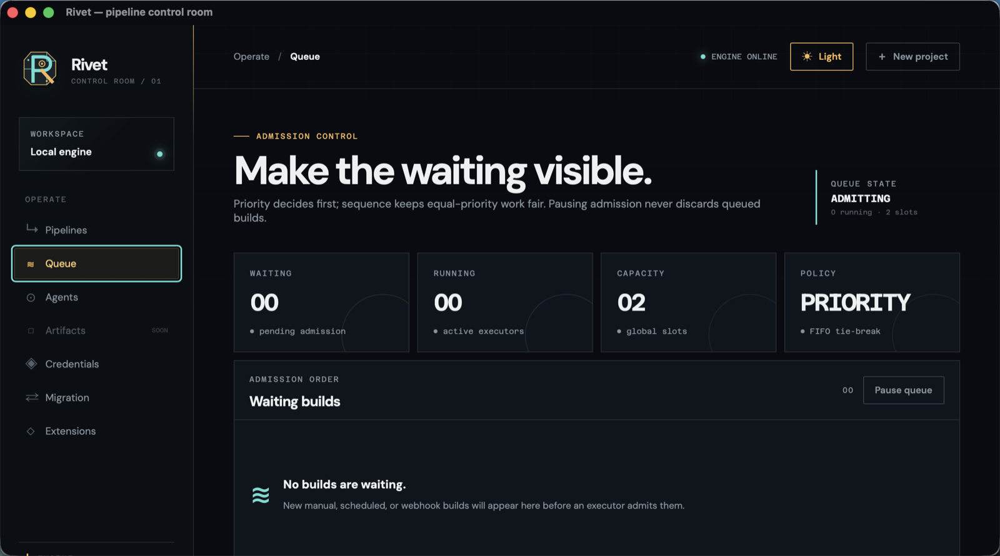
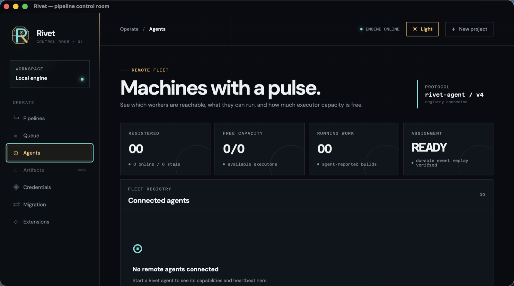

# Rivet — A Modern Jenkins Alternative

### Rust-native CI/CD automation for teams that want a clearer build signal.

Rivet is an open-source, self-hosted CI/CD platform for defining, running, and
operating build pipelines from one focused control room. It combines an
explicit `Rivetfile.toml`, a Rust execution engine, durable SQLite history, a
headless HTTP/WebSocket API, a CLI, and a Tauri desktop application.

If you are evaluating Jenkins alternatives, Rivet offers a fresh architecture
to try: local-first operation, visible queue and stage state, typed events,
remote-agent execution, and a modern developer-tool interface. It is built
independently from Jenkins and is intentionally not a feature-for-feature clone
of Jenkins or its Java plugin ecosystem.

Rivet is currently an early alpha. The working slices below are real and tested,
but cross-platform packaging, production operations, broad Jenkins migration,
and full Jenkins parity are not claimed.

<p align="center">
  
</p>

<p align="center">
  <a href="https://github.com/OthmaneBlial/Rivet/releases">Download</a> ·
  <a href="ROADMAP.md">Roadmap</a> ·
  <a href="https://github.com/OthmaneBlial/Rivet/issues">Issues</a> ·
  <a href="CONTRIBUTING.md">Contributing</a> ·
  <a href="SECURITY.md">Security</a>
</p>

<p align="center">
  <a href="https://github.com/OthmaneBlial/Rivet/releases"></a>
  <a href="LICENSE"></a>
  <a href="https://www.rust-lang.org/"></a>
  <a href="https://tauri.app/"></a>
  
</p>

**95% verified** · `███████████████████░`<br>
Weighted evidence score: **96.95 / 100** · displayed conservatively as the
whole-number floor. This measures the weighted product scope in
[ROADMAP.md](ROADMAP.md), not Jenkins parity.

## See Rivet in action

[](https://github.com/OthmaneBlial/Rivet/releases/download/v0.1.0-alpha/rivet-desktop-demo.mp4)

The 50-second preview shows the real macOS control room, a passed local
pipeline, the Jenkinsfile migration assistant, queue visibility, remote-agent
status, and the light/dark workspace. [Watch or download the full MP4](https://github.com/OthmaneBlial/Rivet/releases/download/v0.1.0-alpha/rivet-desktop-demo.mp4).

## Why look for a Jenkins alternative?

Jenkins remains a capable and widely used automation server. Rivet exists for
teams that want to evaluate a newer CI/CD architecture alongside it: a smaller
local-first control room, explicit pipeline contracts, and build state that is
easy to inspect from the CLI, API, or desktop UI.

In many CI/CD systems, the operator reconstructs what is happening from
scattered logs, opaque configuration, queue state, and provider callbacks.
Rivet keeps the execution model explicit:

- the pipeline is a versioned TOML file;
- each build has a durable identity, source snapshot, stage state, logs, and
  history;
- queue admission, cancellation, retry, and resource requirements are visible;
- the same Rust core powers the CLI, headless server, and desktop client.

The result is an auditable foundation for local development and self-hosted
automation, with a path toward distributed runners. Think of it as a modern
Jenkins alternative for teams who value inspectability and a Rust-native core,
not as a promise that every Jenkins plugin already works in Rivet.

## What Rivet gives you

### Define CI/CD pipelines you can review

`Rivetfile.toml` uses explicit executable and argument arrays. Pipelines support
validated stage dependencies, stable topological ordering, parallel independent
stages, parameters, deterministic conditional stages with explicit `skipped`
outcomes, timeouts, declared artifacts, optional stage ownership, and
per-artifact retention windows.

### Run and observe every build

The native process runner streams stdout and stderr with bounded line
retention, supports cancellation and cleanup, and records typed build events.
The scheduler provides FIFO ordering, bounded priorities, per-project/global
capacity, pause/resume, queue telemetry, and pre-execution cancellation.

Build details, stage movement, live output, retry actions, checksummed artifact
downloads, retention pruning, and project-scoped local CI cache operations are
available through the CLI, API, and desktop control room. Cache keys can include
branch, platform, local Git revision, and lockfile-hash context.

### Connect repositories and triggers

Rivet can inspect Git source at build admission and exercise clone, checkout,
fetch, clean, submodule, and explicit revision preparation. It supports local
project onboarding, remote clone onboarding into an explicit destination,
repository polling, persistent UTC cron schedules, signed generic webhooks,
internal passed-build gates, and provider completion mappings for GitHub
Actions, GitLab CI, and Bitbucket Pipelines.

### Start migrating from Jenkins deliberately

Use the migration analyzer to turn a readable Jenkinsfile into a reviewed
`Rivetfile.toml` draft. Simple declarative stages, quoted shell steps, typed
parameters, static environment values, safe archive patterns, and explicit
parallel-stage dependencies can be converted; unsupported Groovy and
plugin-specific behavior is reported instead of executed or guessed.

```sh
cargo run -p rivet -- migrate Jenkinsfile --output Rivetfile.toml
```

Review the generated file and every warning before running it. Rivet does not
claim arbitrary Jenkins plugin compatibility. The machine-readable
[Jenkins compatibility matrix](compat/jenkins-compatibility.json) records each
claim with an explicit status and evidence path.

### Add capacity without losing the signal

Remote agents register through a versioned authenticated protocol, advertise
executor/CPU/memory/disk capabilities, receive compatible assignments, run through
the shared Rust pipeline runner, and relay typed events, output, cancellation,
artifacts, and bounded retry/recovery state.

### Operate with deliberate boundaries

The Tauri desktop client embeds a loopback Rust engine and starts in light mode,
with a persistent dark-mode toggle. The headless server provides health and
readiness probes, scoped API identities, opaque sessions, audit records,
authenticated metrics, graceful shutdown, and a bounded extension surface.
The local credential vault encrypts provider credentials, records an owner
identity for rotation/audit, and keeps projects scoped to opaque references
rather than ordinary pipeline records. The CLI supports `--owner` without
placing secrets in process arguments.

For example, list only credentials owned by one identity from the CLI:

```sh
rivet credential list \
  --owner user:42 \
  --passphrase-file /private/path/passphrase
```

The headless API exposes the same inventory boundary with
`GET /api/v1/credentials?owner=user%3A42`. This endpoint is admin-authenticated
and returns summaries only; credential secrets are never returned. The desktop
credential inventory also has an owner filter so operators can review one
identity's scope without mixing it with the rest of the vault.

## Screenshots

| Pipeline control room | Migration assistant |
| --- | --- |
|  |  |

| Queue control room | Remote-agent fleet |
| --- | --- |
|  |  |

The interface is intentionally honest about boundaries: unavailable engine
state, experimental areas, empty queues, and future work are shown in the UI
instead of being presented as completed functionality.

## Quick start

The first public release is a source-oriented alpha. The current repository
does not require Docker or Podman for the local pipeline path.

### Requirements

- Rust stable and Cargo
- Git
- Node.js and npm for the desktop client
- Tauri desktop prerequisites for the operating system where you build the UI

The checked-in local validation and release smoke path is verified on macOS.
Windows and Linux packaging, clean-install behavior, and target-platform
interoperability still need their own evidence.

### Run the CLI against a repository

```sh
git clone https://github.com/OthmaneBlial/Rivet.git
cd Rivet

cargo run -p rivet -- init .
cargo run -p rivet -- project create rivet --repository .
cargo run -p rivet -- run rivet
cargo run -p rivet -- builds rivet
cargo run -p rivet -- inspect rivet --build 1
cargo run -p rivet -- logs rivet --build 1
```

The sample `Rivetfile.toml` runs the repository formatter and workspace tests.
For a short, dependency-light walkthrough use
[`examples/demo/Rivetfile.toml`](examples/demo/Rivetfile.toml), which is also
the pipeline used for the checked-in desktop demo capture.

### Migrate a Jenkinsfile

```sh
cargo run -p rivet -- migrate ./Jenkinsfile --output ./Rivetfile.toml
```

The command refuses to overwrite an existing file unless `--force` is passed.
The output is a draft: inspect its status and warnings before using it in a
real CI/CD workflow.

### Restrict container image registries (optional)

Container steps can be restricted to a deployment-owned comma-separated
allow-list. Unqualified images such as `rust:1.85` are evaluated as
`docker.io`; an image from any other registry is refused before the runtime is
invoked.

```sh
export RIVET_ALLOWED_CONTAINER_REGISTRIES=ghcr.io,docker.io
```

The policy does not install or start Docker/Podman. The repository verifies the
policy and process controls through a local runtime shim; behavior against a
real container daemon remains an explicit release gate.

### Run the desktop control room

```sh
cd apps/desktop
npm install
npm run tauri dev
```

Use **New project** to connect a local checkout or bootstrap a remote clone.
The app starts in light mode; use the top-right theme control to switch to
dark mode. The theme preference is persisted locally.

## Download

[`v0.1.0-alpha`](https://github.com/OthmaneBlial/Rivet/releases/tag/v0.1.0-alpha)
contains:

- an optimized macOS arm64 CLI binary;
- an unsigned macOS `Rivet.app` bundle for local evaluation;
- SHA-256 checksums and the local validation manifest;
- the demo MP4 used by this README.

The macOS bundle is unsigned and is not notarized. macOS may ask you to confirm
the first launch. There are no Windows or Linux installers in this release.

## How it works

```text
Rivetfile.toml
      │ parsed and validated by rivet-core
      ▼
Queue + scheduler ───────► local Rust process runner
      │                              │
      │                              ├── stage events / logs / artifacts
      │                              ▼
      ├──────────────────────► SQLite history + local cache
      │
      ├── REST + WebSocket API ──► CLI / Tauri control room
      │
      └── authenticated agent protocol ──► compatible remote workers
```

The native boundary owns process execution, filesystem access, Git/SCM
operations, persistence, credentials, cancellation, and transport. The web
client is an interaction layer over typed HTTP/WebSocket and Tauri commands.

## Technology

- **Rust 2024 workspace** for domain contracts, execution, storage, SCM,
  authentication, credentials, extensions, server transport, and CLI behavior.
- **SQLite** for migrations, build projections, event replay, schedules, cache
  metadata, audit records, and artifact metadata.
- **Axum/Tokio HTTP + WebSocket transport** for the headless server and live
  build events.
- **React + TypeScript + Vite** for the operator interface.
- **Tauri 2** for a native desktop bundle with an ephemeral loopback engine
  origin.
- **WASM and subprocess extension contracts** with bounded frames and explicit
  permissions; filesystem, network, process, and clock capabilities are not
  exposed to WASM modules.

## Security and privacy

Rivet is designed for local-first operation, but it is not a security product
or a hosted service. Review the [security policy](SECURITY.md) and keep these
boundaries in mind:

- never commit tokens, private keys, passwords, or real provider payloads;
- use opaque credential IDs and the encrypted local vault for SCM/provider
  secrets;
- use an exact CORS allow-list and authenticated transport for remote binds;
- treat container declarations, remote agents, extensions, and migration drafts
  as capabilities that require deliberate review;
- use disposable repositories and loopback fixtures for protocol testing.

## Current status

The repository currently reports **96.95 / 100 weighted evidence points** and
displays **95% verified**. This is an engineering progress measure, not a
promise of complete platform coverage.

| Boundary | Status |
| --- | --- |
| Rust pipeline model, local runner, SQLite history, CLI workflow | **Working and locally tested** |
| Headless API, WebSocket events, queue controls, schedules, triggers, artifacts, cache | **Working slices with local evidence** |
| Tauri control room, light default, dark mode, offline recovery, packaged loopback engine | **Working and locally tested, including packaged window QA** |
| Remote-agent protocol and shared-runner execution | **Working local vertical slice** |
| GitHub/GitLab/Bitbucket signed completion mappings | **Working locally; provider deployment evidence remains** |
| Docker/Podman daemon behavior and artifact extraction, external identity providers, signed installers, Windows/Linux packages | **Planned or unverified** |
| Jenkinsfile migration | **Experimental analyzer; review every finding and draft** |

See the [weighted roadmap](ROADMAP.md) for the exact gates and denominator.

## Building and validating from source

Format, test, and build the core locally:

```sh
cargo fmt --all -- --check
cargo test --workspace
(cd apps/desktop && npm install && npm run build)
./scripts/local-documentation-check.sh
```

Run the full macOS release gate:

```sh
./scripts/local-release-check.sh
```

The gate checks repository hygiene and progress consistency, Rust formatting
and tests, the optimized CLI, the desktop web client, the native Tauri host,
the unsigned macOS bundle and packaged loopback engine, real temporary-data
SCM/CLI workflows, queue priority and cancellation, backup/restore,
authentication, the checked-in compatibility corpus and live adapters, and
deployment hardening. It writes a versioned SHA-256 manifest to a temporary
release directory. The gate is local by design; this repository intentionally
has no GitHub Actions workflow.

If the release gate reports `no Tauri window (-2700)`, the bundle and engine
may already be healthy but macOS has denied the automation probe. Grant
Accessibility access to the terminal running the check under **System Settings
→ Privacy & Security → Accessibility**, then rerun the gate. The window check
is intentionally strict and is never skipped.

## Roadmap

The next meaningful gates are:

- final packaged Tauri-window interaction and clean-install QA;
- broader provider lifecycle/event coverage and deployment-specific keychain
  evidence;
- external identity providers and richer ownership workflows;
- permanent differential compatibility evidence from a deployed Jenkins
  instance;
- broader container runtime, migration, platform, observability, and release
  packaging coverage.

Read [ROADMAP.md](ROADMAP.md) before treating a partial or experimental slice
as production-ready.

## Contributing

The most useful contributions are reproducible and focused:

1. Read [CONTRIBUTING.md](CONTRIBUTING.md) and the relevant roadmap gate.
2. Run the local checks before opening an issue or pull request.
3. Include the operating system, exact command, fixture/repository shape, and
   observed result.
4. Contribute tests, fixtures, protocol evidence, documentation, or a small
   vertical slice with its boundary clearly labelled.

Please do not include secrets, private keys, provider tokens, real hostnames,
customer repositories, or personal configuration in issues, screenshots, or
pull requests.

## License

Rivet is released under the [Apache License 2.0](LICENSE).
